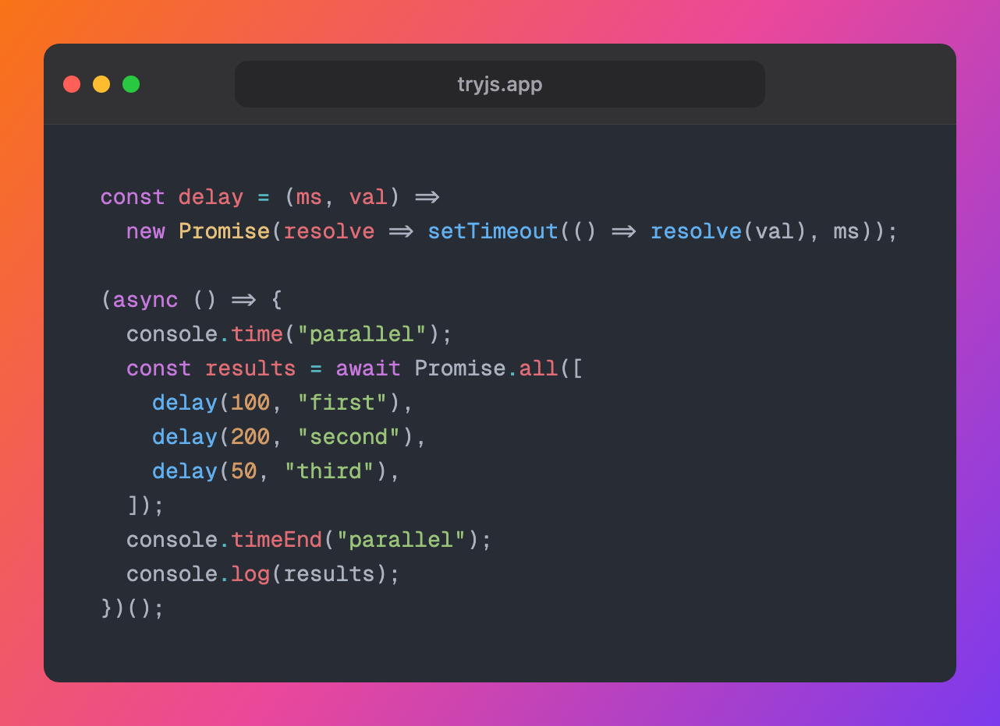

# TryJS

A fast, free JavaScript & TypeScript playground that runs entirely in your browser. Write code, see output instantly — no setup, no backend.

**Live:** [tryjs.app](https://tryjs.app) · **Features:** [tryjs.app/features](https://tryjs.app/features)



## Features

- **Instant execution** — code auto-runs on change with debounce; `Cmd+Enter` runs immediately
- **JavaScript & TypeScript** — toggle with one click; TypeScript is transpiled in-browser via Sucrase
- **NPM imports** — bare specifiers like `import confetti from "canvas-confetti"` are rewritten to esm.sh and executed in the sandbox
- **Snippet gallery** — ready-to-run examples across JS fundamentals, async patterns, and TypeScript essentials
- **Share & embed** — copy a URL that preserves editor state, or embed as an iframe in docs and blog posts
- **Export as image** — generate code screenshots with syntax themes, Safari/minimal frames, padding options, and gradient backgrounds (download PNG or copy to clipboard)
- **REPL-style evaluation** — bare expressions display their result in the console, like Chrome DevTools
- **Console output** — supports `log`, `warn`, `error`, `info`, `table`, `time`/`timeEnd`, and `clear`
- **Sandboxed execution** — code runs in an iframe sandbox with a 5-second timeout
- **6 syntax themes** — One Dark, One Light, Dracula, GitHub Light, Monokai, Solarized Dark
- **3 editor fonts** — Geist Mono, Fira Code, JetBrains Mono
- **Resizable split pane** — drag the divider between editor and console
- **Code persistence** — saved to localStorage per language
- **Mobile support** — editor/console tabs on small screens
- **Features page** — SEO-friendly landing page at `/features`

## Tech Stack

| Layer | Choice |
|-------|--------|
| UI | Preact + Preact Signals |
| Editor | CodeMirror 6 |
| TS Transpiler | Sucrase |
| Build | Vite |
| Hosting | Vercel |

## Development

```bash
# Install dependencies
npm install

# Start dev server
npm run dev

# Type-check & build
npm run build

# Preview production build
npm run preview
```

## Keyboard Shortcuts

| Shortcut | Action |
|----------|--------|
| `Cmd+Enter` | Run code |
| `Cmd+S` | Save to localStorage |
| `Cmd+L` | Clear console |

## Project Structure

```
src/
  app.tsx              # App root, routing, keyboard bindings
  components/
    Editor/            # CodeMirror editor, themes, extensions
    Console/           # Console output display
    Toolbar/           # Language toggle, GitHub/BMC links
    StatusBar/         # Help, snippets, shortcuts, theme/font selects
    SplitPane/         # Draggable editor/console split
    Gallery/           # Snippet gallery modal
    Screenshot/        # Export-as-image modal
    Toast/             # Toast notifications
    Features/          # /features landing page
  data/snippets.ts     # Snippet definitions
  hooks/               # useDebounce, useKeyboard
  sandbox/             # Sandboxed code execution, transpiler
  state/               # Preact signals (editor, console, settings, UI)
  utils/               # Share encoding, screenshot renderer, constants
```

## License

MIT
