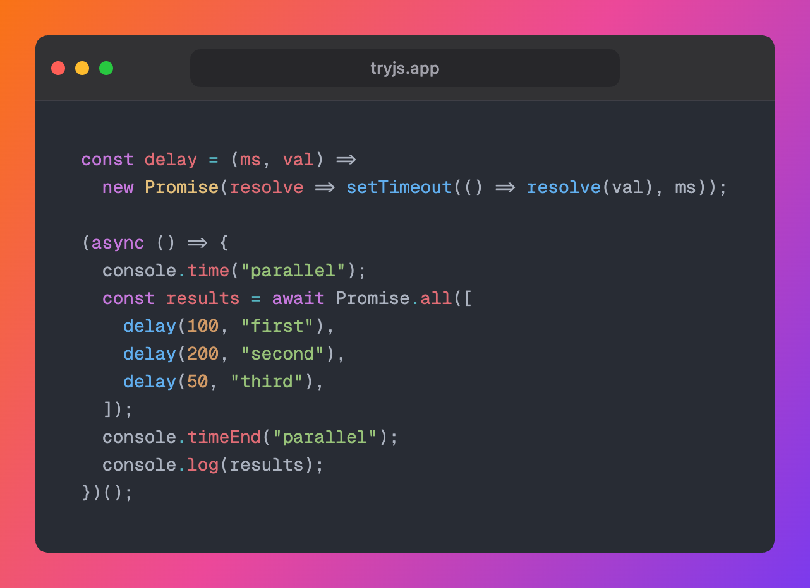

# TryJS

A fast, free JavaScript & TypeScript playground that runs entirely in your browser. Write code, see output instantly — no setup, no backend.

**Live:** [tryjs.app](https://tryjs.app) · **Features:** [tryjs.app/features](https://tryjs.app/features)



## Features

### Editor & IntelliSense

- **Smart code completions** — 60+ snippet templates (`fn`, `cl`, `map`, `tc`, `imp`, `ust`, `uef`, `rfc`…), global API dot-access (`console.`, `Math.`, `JSON.`, `Object.`, `Array.`, `Promise.`, `document.`), and heuristic type inference for string/array/promise instance methods
- **TypeScript Language Service** — real type-aware IntelliSense powered by `ts.createLanguageService()` with `getCompletionsAtPosition()` for semantic completions
- **Hover type info** — hover over any identifier to see its type signature and documentation via `getQuickInfoAtPosition()`
- **TypeScript type checking** — background semantic diagnostics surface structural errors in the console after execution
- **npm import suggestions** — type `import ... from "` to get suggestions from 50+ popular packages (lodash, zod, dayjs, axios…)
- **React/JSX completions** — hooks (`useState`, `useEffect`…), JSX attributes (`className`, `onClick`…), and component scaffolding snippets
- **6 syntax themes** — One Dark, One Light, Dracula, GitHub Light, Monokai, Solarized Dark
- **3 editor fonts** — Geist Mono, Fira Code, JetBrains Mono
- **Configurable editor** — font size, tab size, word wrap, and auto-run delay — all persisted to localStorage

### JavaScript & TypeScript Playground

- **Instant execution** — code auto-runs on change with configurable debounce; `Cmd+Enter` runs immediately
- **JavaScript & TypeScript** — toggle with one click; TypeScript is transpiled in-browser via Sucrase
- **NPM imports** — bare specifiers like `import confetti from "canvas-confetti"` are rewritten to [esm.sh](https://esm.sh) and executed in the sandbox
- **REPL-style evaluation** — bare expressions display their result in the console, like Chrome DevTools
- **Console output** — supports `log`, `warn`, `error`, `info`, `table`, `time`/`timeEnd`, and `clear`
- **Sandboxed execution** — code runs in an iframe sandbox with a 5-second timeout (15s for module loading)

### Web Playground

- **Vanilla mode** — tabbed HTML/CSS/JS editor with a live iframe preview and built-in console drawer
- **React mode** — write JSX components with a CSS tab; live-rendered with React 19 from esm.sh, including error/warning badges and a starter template

### Regex Playground

- **Real-time matching** — enter a pattern and test string, see highlighted matches instantly
- **Flag toggles** — enable/disable `g`, `i`, `m`, `s`, `u`, `d` flags with one click
- **Explain mode** — human-readable breakdown of any regex pattern, token by token
- **Match details view** — inspect match indices, captured groups, and named groups in a table
- **Pattern library** — 15+ curated common patterns (email, URL, phone, date, IP address…) with explanations, use cases, and FAQ
- **Detail pages** — each pattern has a dedicated SEO page at `/regex/:slug`

### Snippet Gallery

- **Ready-to-run examples** — organized by category: JS Fundamentals, Async Patterns, TypeScript Essentials
- **Gallery page** — browse all snippets at `/snippets` with category filtering
- **Detail pages** — individual snippet pages at `/snippets/:slug` with code, explanation, and related snippets
- **Load into playground** — one-click to load any snippet directly into the editor

### Share & Export

- **Share as URL** — copy a link that preserves full editor state via lz-string compression in the URL hash
- **Embed code** — generate an iframe embed snippet for docs and blog posts (`?embed=1` hides UI chrome)
- **Export as image** — generate code screenshots with syntax themes, Safari/minimal frames, padding options, and gradient backgrounds (download PNG or copy to clipboard)

### General

- **Resizable split pane** — drag the divider between editor and console; position persisted across sessions
- **Code persistence** — saved to localStorage per language and mode
- **Mobile support** — responsive layout with editor/console tabs on small screens
- **SEO** — dynamic meta tags, canonical URLs, JSON-LD structured data (schema.org) with breadcrumbs for all pages
- **Analytics** — privacy-friendly event tracking via Vercel Analytics

## Tech Stack

| Layer         | Choice                  |
| ------------- | ----------------------- |
| UI            | Preact + Preact Signals |
| Editor        | CodeMirror 6            |
| TS Transpiler | Sucrase                 |
| TS Compiler   | TypeScript 5 (CDN, lazy-loaded) |
| Build         | Vite                    |
| Hosting       | Vercel                  |

## Development

```bash
# Install dependencies
npm install

# Start dev server
npm run dev

# Type-check & build
npm run build

# Preview production build
npm run preview
```

## Keyboard Shortcuts

| Shortcut    | Action               |
| ----------- | -------------------- |
| `Cmd+Enter` | Run code             |
| `Cmd+S`     | Save to localStorage |
| `Cmd+L`     | Clear console        |
| `Tab`       | Accept completion    |

## Project Structure

```
src/
  app.tsx                # App root, routing, keyboard bindings
  components/
    Editor/              # CodeMirror editor, themes, extensions
      completions.ts     # Snippet, API, JSX, npm completion sources
      hover.ts           # Hover-to-see-type tooltip extension
      extensions.ts      # Editor extensions & autocompletion wiring
      themes.ts          # Syntax themes & completion icon styling
    Console/             # Console output display
    WebEditor/           # Tabbed HTML/CSS/JS editor for web mode
    WebPreview/          # Live iframe preview with console drawer
    ReactEditor/         # JSX + CSS tabbed editor for React mode
    ReactPreview/        # Live React component preview
    Regex/               # Regex playground, explainer, pattern library
    Toolbar/             # Language toggle, web/react mode switch, links
    StatusBar/           # Help, snippets, shortcuts, theme/font selects
    SplitPane/           # Draggable editor/console split
    Gallery/             # Snippet gallery modal
    Snippets/            # Snippet gallery & detail pages
    Screenshot/          # Export-as-image modal
    Toast/               # Toast notifications
    Features/            # /features landing page
  data/
    snippets.ts          # Snippet definitions with categories
    regexPatterns.ts     # Regex pattern library with metadata
  hooks/                 # useDebounce, useKeyboard
  sandbox/
    executor.ts          # Sandboxed code execution orchestrator
    transpiler.ts        # TypeScript/JSX transpilation via Sucrase
    type-checker.ts      # TypeScript semantic diagnostics
    ts-completions.ts    # TS Language Service for completions & hover
  state/                 # Preact signals (editor, console, settings, UI)
  utils/                 # Share encoding, screenshot renderer, SEO, constants
```

## Roadmap

What's coming next — features we're actively exploring:

- **Console Object Inspector** — expand and collapse objects, arrays, Maps, and Sets inline, just like Chrome DevTools
- **Multi-file Tabs** — create multiple files, import between them, and build real modules in the browser
- **AI Assist** — explain code, fix errors, and generate snippets with an inline AI assistant
- **GitHub Gist Sync** — save your playground to a Gist and load any Gist as a playground with one click

Have an idea? [Open an issue](https://github.com/berkinduz/try-js/issues) — we'd love to hear it.

## License

MIT
